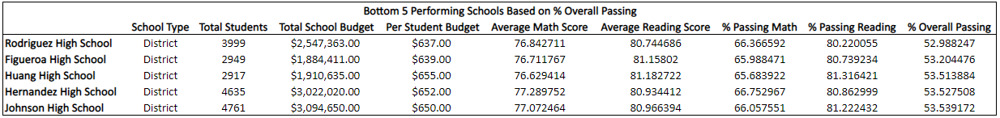
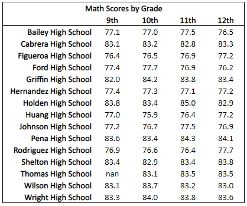

# School_District_Analysis 

## Project Overview
Helping Maria, the Chief Data Scientist for a city school system, analyze information. Maria is responsible for preparing all standardized test data for analysis, reporting, and presentation to provide insight on performance trends and patterns. She also informs discussions and strategic decisions at the school and district levels. I will be analyzing data on student funding and student standardized test scores to assist with providing insights on school performance.

## Resources
- Data Source: schools_complete.csv & students_complete.csv
- Software: Python 3.7.6, Conda 4.8.3, Pandas, Jupyter Notebook

## Summary
Based on the data and the tables below, it is observed that the top performing schools are charter type schools as opposed to district schools. The charter schools had an overall passing percentage of about 89% to 91% while district schools had a passing percentage of about 52% to 55%. Looking closer at the summary tables, an increase in spending per student did not increase the overall passing percentage of students. However, it can be seen that the large schools had the lowest overall passing percentage, and it can be noted that all district schools are classified as a large school size. 

- Top 5 and Bottom 5 Performing Schools, Based on Overall Passing Rate

- District Summary

- Average Math Score Received by Students in each Grade Level at each School

- Average Reading Score Received by Students in each Grade Level at each School

- School Performance Based on the Budget per Student

- School Perfrormance Based on the School Size

- School Performance Based on the Type of School 

## Challenge Overview
The grades of the ninth graders at Thomas High School have been changed. The Thomas High School ninth grade math and reading scores will be replaced with NaN. The effects of the changes in the data will then be analyzed. 

## Challenge Summary
After updating the data so that the Thomas High School 9th graders' math and reading scores are NaN, the % Passing Math and % Passing Reading each dropped by 1%, resulting in the % Overall Passing to drop by 1% on a ditstrict level. Focusing in on Thomas High School, the changes in the dataset have knocked Thomas High School from being second ranked in the district to being ranked at No. 8.  In addition, the % Passing Math dropped to 67% and the % Passing Reading dropped to 70%. The passing percentages were drastically affected since the ninth graders make up 28% of the total students at Thomas High School, and are no longer being included in the passing percentage calculations. However the scores by school spending, size, and type are unaffected. 

- Top 5 and Bottom 5 Performing Schools, Based on Overall Passing Rate

- District Summary

- Average Math Score Received by Students in each Grade Level at each School

- Average Reading Score Received by Students in each Grade Level at each School

- School Performance Based on the Budget per Student

- School Perfrormance Based on the School Size

- School Performance Based on the Type of School 

