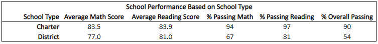

# School_District_Analysis 

## Project Overview
Helping Maria, the Chief Data Scientist for a city school system, analyze information. Maria is responsible for preparing all standardized test data for analysis, reporting, and presentation to provide insight on performance trends and patterns. She also informs discussions and strategic decisions at the school and district levels. I will be analyzing data on student funding and student standardized test scores to assist with providing insights on school performance.

## Resources
- Data Source: schools_complete.csv & students_complete.csv
- Software: Python 3.7.6, Conda 4.8.3, Pandas, Jupyter Notebook

## Summary
- Top 5 and Bottom 5 Performing Schools, Based on Overall Passing Rate

- Average Math Score Received by Students in each Grade Level at each School

- Average Reading Score Received by Students in each Grade Level at each School

- School Performance Based on the Budget per Student

- School Perfrormance Based on the School Size

- School Performance Based on the Type of School 

## Challenge Overview

## Challenge Summary
- Top 5 and Bottom 5 Performing Schools, Based on Overall Passing Rate
- Average Math Score Received by Students in each Grade Level at each School
- Average Reading Score Received by Students in each Grade Level at each School
- School Performance Based on the Budget per Student
- School Perfrormance Based on the School Size
- School Performance Based on the Type of School 
